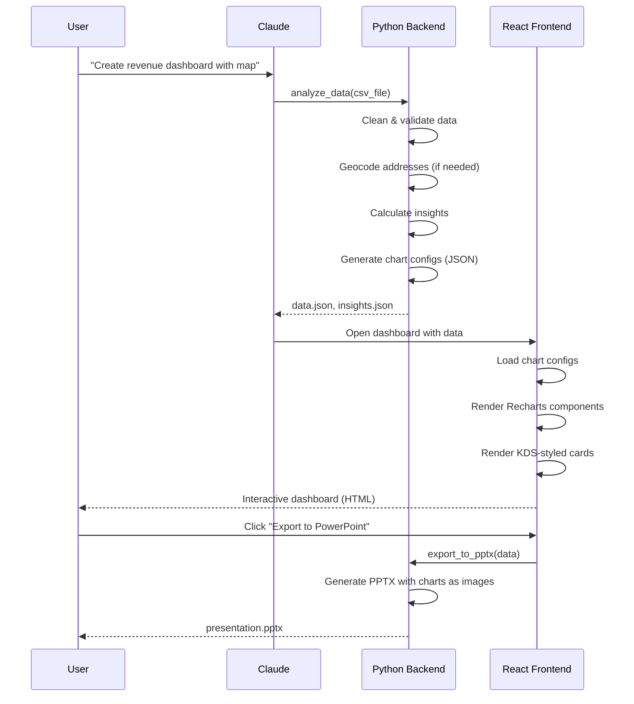

# KIE v3 Architecture - Complete System Design

**Version**: 3.0.0-alpha
**Date**: 2026-01-02
**Status**: Architecture Planning

---

## Executive Summary

KIE v3 represents a fundamental architectural shift from v2, aligning fully with the **Kearney Design System (KDS)** and modern web technologies. The key insight: **Python handles data, React handles visualization**.

### Core Philosophy Change

**KIE v2** (Deprecated):
```
Python → matplotlib → PNG images → Embed in slides/docs
❌ Not KDS-compliant (can't customize Recharts patterns)
❌ Static images (not interactive)
❌ Manual color management
```

**KIE v3** (New):
```
Python → JSON data → Recharts (React) → Interactive KDS-compliant viz
✅ Full KDS compliance (official Recharts components)
✅ Interactive dashboards
✅ Automatic brand enforcement
✅ Geospatial capabilities
```

---

## Table of Contents

1. [System Architecture](#system-architecture)
2. [Technology Stack](#technology-stack)
3. [Core Components](#core-components)
4. [Data Flow](#data-flow)
5. [Geospatial System](#geospatial-system)
6. [KDS Integration](#kds-integration)
7. [API Design](#api-design)
8. [Security Model](#security-model)
9. [Performance Targets](#performance-targets)
10. [Deployment Strategy](#deployment-strategy)

---

## System Architecture

### High-Level Overview

```
┌────────────────────────────────────────────────────────────────┐
│                        CLAUDE CODE (Orchestrator)              │
│  - Conversational requirements gathering                       │
│  - Project management                                          │
│  - Version control (git)                                       │
└────────────────────────────────────────────────────────────────┘
                                 │
                    ┌────────────┴────────────┐
                    ▼                         ▼
┌─────────────────────────────┐   ┌─────────────────────────────┐
│   PYTHON BACKEND (core_v3/)  │   │  REACT FRONTEND (web_v3/)   │
│  - Data ingestion/cleaning   │   │  - Recharts visualizations  │
│  - Statistical analysis      │   │  - KDS component library    │
│  - Insight generation        │   │  - Interactive dashboards   │
│  - Geocoding                 │   │  - Slide previews           │
│  - ML/modeling               │   │  - Export controls          │
│  - PowerPoint generation     │   │                             │
└─────────────────────────────┘   └─────────────────────────────┘
                    │                         │
                    └────────────┬────────────┘
                                 ▼
                    ┌──────────────────────┐
                    │   OUTPUTS/EXPORTS    │
                    │  - Interactive HTML  │
                    │  - PowerPoint (PPTX) │
                    │  - PDF reports       │
                    │  - Data files (JSON) │
                    └──────────────────────┘
```

### Directory Structure

```
KIE/
├── core/                          # v2 (FROZEN - no changes)
│   └── [existing v2 code]
│
├── core_v3/                       # NEW: Python backend
│   ├── __init__.py
│   ├── version.py                 # Version detection
│   │
│   ├── brand/                     # KDS brand system
│   │   ├── __init__.py
│   │   ├── colors.py              # Official KDS colors
│   │   ├── typography.py          # KDS typography scale
│   │   ├── design_system.py       # Brand management
│   │   └── validator.py           # KDS compliance checking
│   │
│   ├── data/                      # Data processing
│   │   ├── __init__.py
│   │   ├── loaders.py             # CSV, Excel, JSON, SQL
│   │   ├── cleaners.py            # Data cleaning pipelines
│   │   ├── transformers.py        # Data transformations
│   │   └── validators.py          # Data quality checks
│   │
│   ├── geo/                       # NEW: Geospatial system
│   │   ├── __init__.py
│   │   ├── geocoder.py            # Address → Lat/Long
│   │   ├── reverse_geocoder.py    # Lat/Long → Address
│   │   ├── enrichment.py          # ZIP → FIPS, demographics
│   │   ├── projections.py         # Coordinate system transforms
│   │   └── services/
│   │       ├── nominatim.py       # Free OSM geocoder
│   │       ├── mapbox.py          # Paid geocoder (optional)
│   │       └── census.py          # US Census geocoder
│   │
│   ├── analysis/                  # Statistical analysis
│   │   ├── __init__.py
│   │   ├── descriptive.py         # Summary stats
│   │   ├── trends.py              # Trend detection
│   │   ├── anomalies.py           # Outlier detection
│   │   ├── correlations.py        # Relationship analysis
│   │   └── forecasting.py         # Time series predictions
│   │
│   ├── insights/                  # Insight generation
│   │   ├── __init__.py
│   │   ├── extractor.py           # Extract insights from data
│   │   ├── ranker.py              # Prioritize insights
│   │   ├── narrator.py            # Generate narratives
│   │   └── templates/             # Insight templates
│   │
│   ├── export/                    # Output generation
│   │   ├── __init__.py
│   │   ├── json_builder.py        # Chart data → JSON
│   │   ├── pptx_builder.py        # PowerPoint generation
│   │   ├── pdf_builder.py         # PDF reports
│   │   └── templates/             # Slide templates
│   │
│   └── utils/                     # Utilities
│       ├── __init__.py
│       ├── cache.py               # Caching layer
│       ├── config.py              # Configuration
│       └── logger.py              # Logging
│
├── web_v3/                        # NEW: React frontend
│   ├── package.json
│   ├── vite.config.ts
│   ├── tsconfig.json
│   ├── tailwind.config.ts
│   │
│   ├── src/
│   │   ├── main.tsx
│   │   ├── App.tsx
│   │   │
│   │   ├── components/
│   │   │   ├── kds/               # KDS components (from official repo)
│   │   │   │   ├── ChartCard.tsx
│   │   │   │   ├── DataCard.tsx
│   │   │   │   ├── InsightCard.tsx
│   │   │   │   ├── Logo.tsx
│   │   │   │   └── SlideLayout.tsx
│   │   │   │
│   │   │   ├── charts/            # Recharts wrappers
│   │   │   │   ├── BarChart.tsx
│   │   │   │   ├── LineChart.tsx
│   │   │   │   ├── AreaChart.tsx
│   │   │   │   ├── ScatterPlot.tsx
│   │   │   │   └── MapChart.tsx   # Geospatial viz
│   │   │   │
│   │   │   ├── dashboards/        # Dashboard layouts
│   │   │   │   ├── KPIDashboard.tsx
│   │   │   │   ├── AnalyticsDashboard.tsx
│   │   │   │   └── GeoDashboard.tsx
│   │   │   │
│   │   │   └── slides/            # Slide previews
│   │   │       ├── TitleSlide.tsx
│   │   │       ├── ContentSlide.tsx
│   │   │       └── ChartSlide.tsx
│   │   │
│   │   ├── hooks/                 # React hooks
│   │   │   ├── useChartData.ts
│   │   │   ├── useGeocoding.ts
│   │   │   └── useInsights.ts
│   │   │
│   │   ├── lib/                   # Utilities
│   │   │   ├── api.ts             # API client
│   │   │   ├── kds-colors.ts      # KDS color constants
│   │   │   └── utils.ts
│   │   │
│   │   └── styles/
│   │       └── globals.css        # Tailwind + KDS theme
│   │
│   └── public/
│       ├── index.html
│       └── assets/
│
├── tests_v3/                      # Test suite
│   ├── unit/
│   ├── integration/
│   └── e2e/
│
├── docs_v3/                       # Documentation
│   ├── api/
│   ├── guides/
│   └── examples/
│
├── CLAUDE.md                      # Updated for v3
├── KIE_V3_ARCHITECTURE.md         # This file
├── MIGRATION_V2_TO_V3.md          # Migration guide
├── KIE_V3_ROADMAP.md              # Implementation roadmap
└── pyproject.toml                 # Python dependencies

```

---

## Technology Stack

### Python Backend (core_v3/)

```toml
[project]
name = "kie-v3"
version = "3.0.0"
requires-python = ">=3.10"

dependencies = [
    # Data processing
    "pandas>=2.2.0",
    "numpy>=1.26.0",
    "polars>=0.20.0",          # Fast dataframe library

    # Geospatial
    "geopandas>=0.14.0",        # Geospatial data structures
    "shapely>=2.0.0",           # Geometric operations
    "folium>=0.15.0",           # Interactive maps (HTML export)
    "geopy>=2.4.0",             # Geocoding library
    "pyproj>=3.6.0",            # Coordinate transformations

    # Analysis
    "scipy>=1.12.0",            # Statistical functions
    "statsmodels>=0.14.0",      # Time series analysis
    "scikit-learn>=1.4.0",      # ML algorithms

    # Visualization data prep
    "plotly>=5.18.0",           # Alternative viz (fallback)

    # Export
    "python-pptx>=0.6.23",      # PowerPoint generation
    "reportlab>=4.0.0",         # PDF generation
    "openpyxl>=3.1.0",          # Excel files

    # Web/API
    "fastapi>=0.109.0",         # API framework
    "uvicorn>=0.27.0",          # ASGI server
    "pydantic>=2.5.0",          # Data validation

    # Utilities
    "pyyaml>=6.0",              # Configuration
    "python-dotenv>=1.0.0",     # Environment variables
    "httpx>=0.26.0",            # HTTP client (for geocoding APIs)
    "cachetools>=5.3.0",        # Caching
]

[project.optional-dependencies]
dev = [
    "pytest>=8.0.0",
    "pytest-cov>=4.1.0",
    "black>=24.0.0",
    "ruff>=0.1.0",
    "mypy>=1.8.0",
]

geo_premium = [
    # Optional premium geocoding services
    "googlemaps>=4.10.0",       # Google Maps (requires API key)
    # Mapbox doesn't have official Python SDK - use httpx
]
```

### React Frontend (web_v3/)

```json
{
  "name": "kie-v3-web",
  "version": "3.0.0",
  "type": "module",
  "dependencies": {
    "react": "^18.3.1",
    "react-dom": "^18.3.1",

    "recharts": "^2.15.2",
    "lucide-react": "^0.487.0",

    "react-leaflet": "^4.2.1",
    "leaflet": "^1.9.4",

    "@radix-ui/react-dialog": "^1.1.6",
    "@radix-ui/react-select": "^2.1.6",
    "@radix-ui/react-tabs": "^1.1.3",

    "tailwindcss": "^4.1.12",
    "class-variance-authority": "^0.7.1",
    "clsx": "^2.1.1",
    "tailwind-merge": "^3.2.0",

    "axios": "^1.6.0"
  },
  "devDependencies": {
    "@vitejs/plugin-react": "^4.7.0",
    "vite": "^6.3.5",
    "@types/react": "^18.3.1",
    "@types/react-dom": "^18.3.1",
    "typescript": "^5.3.3",
    "@typescript-eslint/eslint-plugin": "^6.19.0",
    "@typescript-eslint/parser": "^6.19.0"
  }
}
```

---

## Core Components

### 1. Geocoding System (`core_v3/geo/`)

#### Architecture

```python
# core_v3/geo/geocoder.py

from typing import Optional, Dict, List, Tuple
from dataclasses import dataclass
from enum import Enum
import asyncio

class GeocodingService(Enum):
    """Available geocoding services."""
    NOMINATIM = "nominatim"  # Free (OpenStreetMap)
    CENSUS = "census"        # Free (US only)
    MAPBOX = "mapbox"        # Paid (requires API key)
    GOOGLE = "google"        # Paid (requires API key)

@dataclass
class GeocodingResult:
    """Standardized geocoding result."""
    address: str
    latitude: float
    longitude: float
    confidence: float  # 0-1
    source: GeocodingService
    metadata: Dict = field(default_factory=dict)

    # Optional enrichments
    country: Optional[str] = None
    state: Optional[str] = None
    county: Optional[str] = None
    city: Optional[str] = None
    postal_code: Optional[str] = None
    fips_code: Optional[str] = None

class GeocodingPipeline:
    """
    Hybrid geocoding with fallback strategy.

    Strategy:
    1. Try Nominatim (free, rate-limited)
    2. If fails, try Census (free, US-only)
    3. If fails and API key available, try paid service
    """

    def __init__(
        self,
        primary_service: GeocodingService = GeocodingService.NOMINATIM,
        fallback_services: List[GeocodingService] = None,
        api_keys: Dict[str, str] = None
    ):
        self.primary = primary_service
        self.fallbacks = fallback_services or [GeocodingService.CENSUS]
        self.api_keys = api_keys or {}

    async def geocode(self, address: str) -> Optional[GeocodingResult]:
        """Geocode single address with fallback."""
        # Try primary service
        result = await self._try_service(self.primary, address)
        if result:
            return result

        # Try fallbacks
        for service in self.fallbacks:
            result = await self._try_service(service, address)
            if result:
                return result

        return None

    async def geocode_batch(
        self,
        addresses: List[str],
        batch_size: int = 100
    ) -> List[Optional[GeocodingResult]]:
        """
        Batch geocode with rate limiting.

        Nominatim: 1 request/second
        Census: No stated limit
        Mapbox: 600 requests/minute (with API key)
        """
        results = []

        for i in range(0, len(addresses), batch_size):
            batch = addresses[i:i+batch_size]

            # Geocode batch concurrently (respecting rate limits)
            batch_results = await asyncio.gather(
                *[self.geocode(addr) for addr in batch]
            )
            results.extend(batch_results)

            # Rate limiting between batches
            if i + batch_size < len(addresses):
                await asyncio.sleep(1.0)  # 1 second between batches

        return results
```

#### Service Implementations

```python
# core_v3/geo/services/nominatim.py

from geopy.geocoders import Nominatim
from geopy.exc import GeocoderTimedOut, GeocoderUnavailable

class NominatimService:
    """Free geocoding via OpenStreetMap."""

    def __init__(self, user_agent: str = "KIE-v3"):
        self.geocoder = Nominatim(user_agent=user_agent)

    async def geocode(self, address: str) -> Optional[GeocodingResult]:
        try:
            location = self.geocoder.geocode(
                address,
                timeout=5,
                addressdetails=True
            )

            if not location:
                return None

            return GeocodingResult(
                address=location.address,
                latitude=location.latitude,
                longitude=location.longitude,
                confidence=0.8,  # Nominatim doesn't provide confidence
                source=GeocodingService.NOMINATIM,
                metadata=location.raw,
                country=location.raw.get('address', {}).get('country'),
                state=location.raw.get('address', {}).get('state'),
                city=location.raw.get('address', {}).get('city'),
                postal_code=location.raw.get('address', {}).get('postcode')
            )

        except (GeocoderTimedOut, GeocoderUnavailable) as e:
            return None
```

#### Enrichment

```python
# core_v3/geo/enrichment.py

import pandas as pd
from typing import Optional

class GeoEnricher:
    """Add geographic metadata to geocoded data."""

    def __init__(self):
        # Load lookup tables (bundled with KIE)
        self.zip_to_fips = self._load_zip_fips_mapping()
        self.fips_to_county = self._load_fips_county_mapping()

    def enrich_zip_code(self, zip_code: str) -> Dict[str, str]:
        """
        ZIP → FIPS → County name.

        Uses Census ZCTA (ZIP Code Tabulation Area) crosswalk.
        """
        fips = self.zip_to_fips.get(zip_code)
        if not fips:
            return {}

        county_name = self.fips_to_county.get(fips)

        return {
            'zip_code': zip_code,
            'fips_code': fips,
            'county_name': county_name,
            'state_fips': fips[:2] if fips else None,
            'county_fips': fips[2:] if fips else None
        }

    def enrich_dataframe(self, df: pd.DataFrame, zip_column: str) -> pd.DataFrame:
        """Add geographic metadata to entire dataframe."""
        enriched = df[zip_column].apply(self.enrich_zip_code)
        enriched_df = pd.DataFrame(enriched.tolist())
        return pd.concat([df, enriched_df], axis=1)
```

---

### 2. Chart Data Builder (`core_v3/export/json_builder.py`)

**Key Concept**: Python generates JSON data that Recharts consumes.

```python
# core_v3/export/json_builder.py

from typing import List, Dict, Any, Optional
from dataclasses import dataclass, asdict
import json
from core_v3.brand.colors import KDSColors

@dataclass
class RechartsBarChart:
    """
    Generate Recharts-compatible bar chart config.

    Output matches KDS requirements:
    - Official 10-color sequence
    - axisLine={false}, tickLine={false}
    - Value labels on bars
    """
    data: List[Dict[str, Any]]
    x_key: str
    y_keys: List[str]
    title: str
    subtitle: Optional[str] = None
    height: int = 300

    def to_json(self) -> Dict[str, Any]:
        """Convert to Recharts config."""

        # Assign colors from KDS sequence
        colors = list(KDSColors.CHART_PALETTE)
        bar_configs = []

        for i, y_key in enumerate(self.y_keys):
            bar_configs.append({
                'dataKey': y_key,
                'fill': colors[i % len(colors)],
                'radius': [4, 4, 0, 0],  # Rounded top corners
                'label': {
                    'position': 'top',
                    'fill': 'currentColor',
                    'fontSize': 12
                }
            })

        return {
            'type': 'bar',
            'title': self.title,
            'subtitle': self.subtitle,
            'height': self.height,
            'data': self.data,
            'config': {
                'xAxis': {
                    'dataKey': self.x_key,
                    'axisLine': False,  # KDS requirement
                    'tickLine': False,  # KDS requirement
                    'tick': {
                        'fill': 'currentColor',
                        'fontSize': 12
                    }
                },
                'yAxis': {
                    'axisLine': False,
                    'tickLine': False,
                    'tick': {
                        'fill': 'currentColor',
                        'fontSize': 12
                    }
                },
                'bars': bar_configs,
                'tooltip': {
                    'contentStyle': {
                        'backgroundColor': 'hsl(var(--card))',
                        'border': '1px solid hsl(var(--border))',
                        'borderRadius': '8px'
                    }
                }
            }
        }

# Usage example
def create_revenue_chart(df: pd.DataFrame) -> Dict:
    """Create KDS-compliant revenue chart."""

    chart = RechartsBarChart(
        data=df.to_dict('records'),
        x_key='quarter',
        y_keys=['revenue'],
        title='Quarterly Revenue',
        subtitle='FY 2025 Performance'
    )

    return chart.to_json()
```

---

### 3. React Chart Component (`web_v3/src/components/charts/BarChart.tsx`)

```tsx
// web_v3/src/components/charts/BarChart.tsx

import { BarChart as RechartsBar, Bar, XAxis, YAxis, Tooltip, ResponsiveContainer, LabelList } from 'recharts';
import { ChartCard } from '../kds/ChartCard';

interface BarChartProps {
  chartData: any; // From Python JSON builder
}

export function BarChart({ chartData }: BarChartProps) {
  const { title, subtitle, height, data, config } = chartData;

  return (
    <ChartCard title={title} subtitle={subtitle}>
      <ResponsiveContainer width="100%" height={height}>
        <RechartsBar data={data}>
          <XAxis
            dataKey={config.xAxis.dataKey}
            axisLine={config.xAxis.axisLine}
            tickLine={config.xAxis.tickLine}
            tick={config.xAxis.tick}
          />
          <YAxis
            axisLine={config.yAxis.axisLine}
            tickLine={config.yAxis.tickLine}
            tick={config.yAxis.tick}
          />
          <Tooltip contentStyle={config.tooltip.contentStyle} />

          {config.bars.map((barConfig: any, i: number) => (
            <Bar
              key={i}
              dataKey={barConfig.dataKey}
              fill={barConfig.fill}
              radius={barConfig.radius}
            >
              <LabelList
                dataKey={barConfig.dataKey}
                position={barConfig.label.position}
                style={{
                  fill: barConfig.label.fill,
                  fontSize: barConfig.label.fontSize
                }}
              />
            </Bar>
          ))}
        </RechartsBar>
      </ResponsiveContainer>
    </ChartCard>
  );
}
```

---

## Data Flow

### End-to-End Example: Creating a Dashboard



### File Workflow

```
1. DATA INGESTION
   User drops: sales_data.csv
   ↓
   Python: Load with pandas/polars
   ↓
   Python: Validate schema
   ↓
   Python: Clean missing values

2. GEOCODING (if addresses present)
   Python: Detect address columns
   ↓
   Python: Batch geocode (Nominatim → Census → Mapbox)
   ↓
   Python: Add lat/long columns
   ↓
   Python: Enrich with FIPS codes

3. ANALYSIS
   Python: Calculate summary stats
   ↓
   Python: Detect trends
   ↓
   Python: Find anomalies
   ↓
   Python: Generate insights

4. CHART CONFIG GENERATION
   Python: Create bar chart config → bar_chart.json
   Python: Create map config → map_chart.json
   Python: Create KPI cards → kpi_data.json

5. REACT RENDERING
   React: Load JSON configs
   ↓
   React: Render Recharts components
   ↓
   React: Apply KDS styling
   ↓
   Output: Interactive HTML dashboard

6. EXPORT (optional)
   React → Python: Request PPTX export
   ↓
   Python: Render charts as images
   ↓
   Python: Build PowerPoint with python-pptx
   ↓
   Output: presentation.pptx
```

---

## Geospatial System

### Map Visualization Strategy

**Principle**: Best tool for the job

| Use Case | Tool | Output | Reason |
|----------|------|--------|--------|
| **Interactive dashboards** | React-Leaflet | HTML with pan/zoom | User interaction needed |
| **Static slides** | Folium → PNG | Image | Embed in PowerPoint |
| **Choropleth maps** | Recharts (custom) | SVG | Matches other charts, KDS colors |
| **Point clusters** | React-Leaflet + MarkerCluster | HTML | Performance with 1000s of points |
| **Heatmaps** | Folium HeatMap | HTML | Density visualization |

### Example: Choropleth Map with Recharts

```python
# core_v3/geo/choropleth_builder.py

import geopandas as gpd
from typing import Dict, List

class ChoroplethBuilder:
    """Build choropleth map config for Recharts."""

    def __init__(self, shapefile_path: str):
        self.gdf = gpd.read_file(shapefile_path)

    def create_config(
        self,
        data: pd.DataFrame,
        join_column: str,
        value_column: str,
        title: str
    ) -> Dict:
        """
        Generate choropleth config.

        Merges data with GeoDataFrame, converts to GeoJSON,
        prepares for Recharts custom shape rendering.
        """
        # Join data
        merged = self.gdf.merge(
            data,
            left_on='GEOID',
            right_on=join_column,
            how='left'
        )

        # Convert to GeoJSON
        geojson = merged.to_json()

        # Assign colors from KDS palette based on value
        merged['color'] = self._assign_colors(
            merged[value_column],
            KDSColors.SEQUENTIAL_PALETTE
        )

        return {
            'type': 'choropleth',
            'title': title,
            'geojson': geojson,
            'data': merged[[join_column, value_column, 'color']].to_dict('records'),
            'config': {
                'colorScale': list(KDSColors.SEQUENTIAL_PALETTE),
                'valueColumn': value_column,
                'tooltip': {
                    'formatter': 'value'
                }
            }
        }
```

---

## KDS Integration

### Color System

```python
# core_v3/brand/colors.py (enhanced from v2)

from dataclasses import dataclass
from typing import Tuple, List

@dataclass(frozen=True)
class KDSColors:
    """Official Kearney Design System colors."""

    # Brand colors
    PRIMARY: str = "#7823DC"
    BLACK: str = "#1E1E1E"
    WHITE: str = "#FFFFFF"
    GRAY: str = "#A5A5A5"

    # Chart palette (MUST use in this order)
    CHART_PALETTE: Tuple[str, ...] = (
        "#D2D2D2",  # 1 - Light Gray
        "#A5A6A5",  # 2 - Medium Gray
        "#787878",  # 3 - Dark Gray
        "#E0D2FA",  # 4 - Light Purple
        "#C8A5F0",  # 5 - Medium Light Purple
        "#AF7DEB",  # 6 - Medium Purple
        "#4B4B4B",  # 7 - Charcoal
        "#1E1E1E",  # 8 - Black
        "#9150E1",  # 9 - Bright Purple
        "#7823DC",  # 10 - Kearney Purple
    )

    # Sequential palette (for choropleths)
    SEQUENTIAL_PALETTE: Tuple[str, ...] = (
        "#F3E5F5", "#E1BEE7", "#CE93D8", "#BA68C8",
        "#AB47BC", "#9C27B0", "#8E24AA", "#7B1FA2",
        "#6A1B9A", "#4A148C"
    )

    @classmethod
    def get_chart_color(cls, index: int) -> str:
        """Get chart color by index (cycles if > 10)."""
        return cls.CHART_PALETTE[index % len(cls.CHART_PALETTE)]

    @classmethod
    def validate_color(cls, color: str) -> bool:
        """Check if color is KDS-approved."""
        all_colors = (
            cls.CHART_PALETTE +
            cls.SEQUENTIAL_PALETTE +
            (cls.PRIMARY, cls.BLACK, cls.WHITE, cls.GRAY)
        )
        return color.upper() in [c.upper() for c in all_colors]
```

### Typography

```python
# core_v3/brand/typography.py

from enum import IntEnum

class KDSFontSize(IntEnum):
    """Official KDS typography scale (in pixels)."""
    H1 = 40
    H2 = 32
    H3 = 24
    H4 = 20
    H5 = 16
    H6 = 14
    BODY = 16
    SMALL = 14
    XS = 12

class KDSFontWeight(IntEnum):
    """KDS font weights."""
    NORMAL = 400
    MEDIUM = 500
    SEMIBOLD = 600
    BOLD = 700

FONT_STACK = "Inter, Arial, sans-serif"

# Chart-specific typography
CHART_TITLE_SIZE = KDSFontSize.H3  # 24px
AXIS_LABEL_SIZE = KDSFontSize.XS    # 12px
DATA_LABEL_SIZE = KDSFontSize.SMALL  # 14px
LEGEND_SIZE = KDSFontSize.XS         # 12px
```

### Brand Validator

```python
# core_v3/brand/validator.py

from typing import List, Dict
from dataclasses import dataclass

@dataclass
class ValidationError:
    """Brand compliance violation."""
    severity: str  # "error" | "warning"
    component: str
    message: str
    fix: str

class KDSValidator:
    """Validate outputs for KDS compliance."""

    def validate_chart_config(self, config: Dict) -> List[ValidationError]:
        """Check chart config against KDS rules."""
        errors = []

        # Rule 1: No gridlines
        if config.get('config', {}).get('xAxis', {}).get('axisLine') != False:
            errors.append(ValidationError(
                severity="error",
                component="xAxis",
                message="axisLine must be false (no gridlines)",
                fix="Set config.xAxis.axisLine = false"
            ))

        # Rule 2: Colors must be from KDS palette
        for bar in config.get('config', {}).get('bars', []):
            color = bar.get('fill')
            if not KDSColors.validate_color(color):
                errors.append(ValidationError(
                    severity="error",
                    component="bar",
                    message=f"Color {color} is not in KDS palette",
                    fix=f"Use KDSColors.CHART_PALETTE[{i}]"
                ))

        # Rule 3: Value labels required
        for bar in config.get('config', {}).get('bars', []):
            if 'label' not in bar:
                errors.append(ValidationError(
                    severity="warning",
                    component="bar",
                    message="Value labels recommended for clarity",
                    fix="Add label config with position='top'"
                ))

        return errors
```

---

## API Design

### REST API (`core_v3/api/`)

KIE v3 exposes a FastAPI server for React frontend communication.

```python
# core_v3/api/main.py

from fastapi import FastAPI, UploadFile, File
from fastapi.middleware.cors import CORSMiddleware
from pydantic import BaseModel
from typing import List, Optional

app = FastAPI(title="KIE v3 API", version="3.0.0")

# Enable CORS for React frontend
app.add_middleware(
    CORSMiddleware,
    allow_origins=["http://localhost:5173"],  # Vite dev server
    allow_methods=["*"],
    allow_headers=["*"],
)

# Data models
class AnalysisRequest(BaseModel):
    file_path: str
    project_type: str
    options: Optional[Dict] = None

class GeocodeRequest(BaseModel):
    addresses: List[str]
    service: Optional[str] = "nominatim"

# Endpoints
@app.post("/api/v3/data/upload")
async def upload_data(file: UploadFile = File(...)):
    """Upload and validate data file."""
    # Save file, validate schema, return data preview
    pass

@app.post("/api/v3/data/analyze")
async def analyze_data(request: AnalysisRequest):
    """Run statistical analysis."""
    # Load data, run analysis, return insights + chart configs
    pass

@app.post("/api/v3/geo/geocode")
async def geocode_addresses(request: GeocodeRequest):
    """Batch geocode addresses."""
    # Run geocoding pipeline, return results
    pass

@app.post("/api/v3/export/pptx")
async def export_powerpoint(data: Dict):
    """Generate PowerPoint from dashboard."""
    # Convert JSON configs to PPTX, return file
    pass

@app.get("/api/v3/health")
async def health_check():
    return {"status": "healthy", "version": "3.0.0"}
```

---

## Security Model

### Geocoding API Keys

```python
# core_v3/utils/config.py

from pathlib import Path
from typing import Optional
import os
from dotenv import load_dotenv

load_dotenv()

class Config:
    """Centralized configuration."""

    # Geocoding API keys (optional)
    MAPBOX_API_KEY: Optional[str] = os.getenv("MAPBOX_API_KEY")
    GOOGLE_MAPS_API_KEY: Optional[str] = os.getenv("GOOGLE_MAPS_API_KEY")

    # API key prompt behavior
    PROMPT_FOR_API_KEYS: bool = os.getenv("PROMPT_FOR_API_KEYS", "true").lower() == "true"

    @classmethod
    def request_api_key(cls, service: str) -> Optional[str]:
        """
        Prompt user for API key if not in environment.

        Claude will ask user: "To use {service}, please provide an API key:"
        """
        if not cls.PROMPT_FOR_API_KEYS:
            return None

        # Return None here - Claude will handle the actual prompt
        return None
```

### User Prompt Pattern

```python
# When geocoding needs paid service:

if not Config.MAPBOX_API_KEY and confidence_threshold_not_met:
    # Claude asks user:
    message = f"""
    Free geocoding services (Nominatim, Census) had low confidence for some addresses.

    For better results, we can use Mapbox Geocoding API.

    Would you like to:
    1. Continue with current results
    2. Provide a Mapbox API key (costs ~$0.50/1000 requests)
    3. Skip geocoding for low-confidence addresses

    If option 2, set environment variable:
    export MAPBOX_API_KEY="your-api-key-here"
    """
```

---

## Performance Targets

### Latency Requirements

| Operation | Target | Maximum |
|-----------|--------|---------|
| Data upload (1MB CSV) | < 500ms | 2s |
| Analysis (1000 rows) | < 2s | 5s |
| Geocoding (100 addresses, free) | < 30s | 60s |
| Geocoding (100 addresses, paid) | < 10s | 20s |
| Chart rendering (React) | < 100ms | 500ms |
| Dashboard load | < 1s | 3s |
| PPTX export | < 5s | 15s |

### Scalability

- **Data size**: Support up to 1M rows (using Polars for large datasets)
- **Concurrent users**: 10 users on single machine (FastAPI + uvicorn)
- **Geocoding**: Batch up to 10,000 addresses (with progress updates)
- **Charts**: Render up to 50 charts in single dashboard

---

## Deployment Strategy

### Development

```bash
# Terminal 1: Python API server
cd /Users/pfay01/Projects/KIE
source .venv/bin/activate
uvicorn core_v3.api.main:app --reload --port 8000

# Terminal 2: React dev server
cd web_v3
npm run dev
# Runs on http://localhost:5173

# Claude Code orchestrates both
```

### Production

```bash
# Build React app
cd web_v3
npm run build
# Outputs to web_v3/dist/

# Serve via FastAPI
# core_v3/api/main.py mounts static files from web_v3/dist/

# Single command to start:
uvicorn core_v3.api.main:app --host 0.0.0.0 --port 8000
```

### Docker (Future)

```dockerfile
# Dockerfile
FROM python:3.11-slim

# Install Node.js for building React app
RUN curl -fsSL https://deb.nodesource.com/setup_20.x | bash -
RUN apt-get install -y nodejs

# Copy source
COPY . /app
WORKDIR /app

# Install Python dependencies
RUN pip install -e .

# Build React frontend
WORKDIR /app/web_v3
RUN npm install && npm run build

# Run API server
WORKDIR /app
CMD ["uvicorn", "core_v3.api.main:app", "--host", "0.0.0.0", "--port", "8000"]
```

---

## Migration Strategy

See `MIGRATION_V2_TO_V3.md` for detailed migration guide.

**Summary**:
- v2 remains untouched and functional
- v3 is opt-in via `KIE_VERSION=3` environment variable
- Claude detects version and routes accordingly
- Users can run both versions side-by-side during transition
- Full cutover after 2-week validation period

---

## Open Questions & Decisions Needed

### 1. Interactive vs Static Maps in PowerPoint

**Question**: When exporting to PowerPoint, should maps be:
- **A)** Static images (current approach)
- **B)** Embedded HTML (PowerPoint 365 feature)
- **C)** QR code linking to interactive version

**Recommendation**: A (static images) for broadest compatibility

### 2. Recharts vs Custom SVG for Choropleths

**Question**: Choropleth maps aren't native to Recharts. Should we:
- **A)** Build custom React component using Recharts primitives
- **B)** Use React-Leaflet for all maps
- **C)** Hybrid: Leaflet for interactive, Recharts for static

**Recommendation**: C (hybrid approach)

### 3. Data Storage Between Sessions

**Question**: Where should processed data persist?
- **A)** File system (`project_state/processed/data.parquet`)
- **B)** SQLite database (`project_state/kie.db`)
- **C)** Both (files for portability, DB for queries)

**Recommendation**: A (file system) - simpler, more portable

---

## Success Criteria

KIE v3 is production-ready when:

- [ ] **KDS Compliance**: 100% of outputs pass `KDSValidator`
- [ ] **Geocoding**: Successfully geocode 95%+ of US addresses
- [ ] **Performance**: All operations meet latency targets
- [ ] **Recharts**: All chart types render correctly in React
- [ ] **Export**: PowerPoint generation produces KDS-compliant slides
- [ ] **Migration**: v2 projects can be converted to v3
- [ ] **Documentation**: Complete API docs + user guides
- [ ] **Testing**: 80%+ code coverage, all integration tests pass

---

## Next Steps

1. **Review & Approve** this architecture document
2. **Create** `MIGRATION_V2_TO_V3.md` (comprehensive migration guide)
3. **Create** `KIE_V3_ROADMAP.md` (12-week implementation plan)
4. **Initialize** `core_v3/` directory structure
5. **Build** Phase 0: Project scaffolding + FastAPI skeleton
6. **Implement** Phase 1: Geocoding system (weeks 1-2)
7. **Implement** Phase 2: JSON builders + React charts (weeks 3-4)
8. **Implement** Phase 3-6: Full feature set (weeks 5-12)

---

**END OF ARCHITECTURE DOCUMENT**

Questions or feedback on this architecture? Let me know before I proceed with the migration guide.
